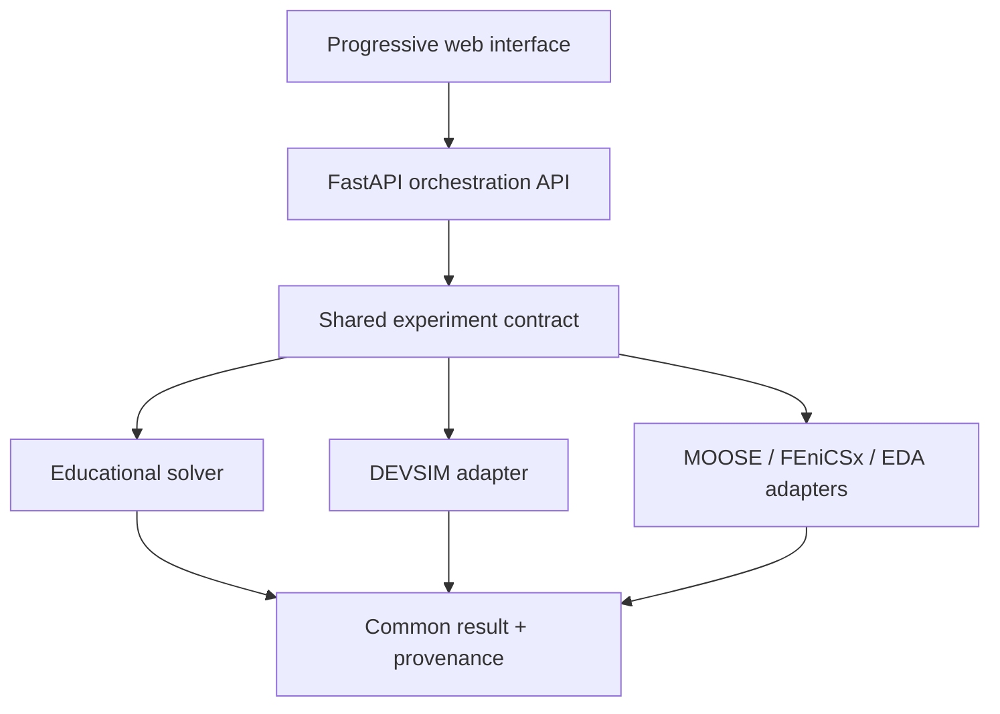

# OpenSemiLab

**An open, progressive semiconductor laboratory for classrooms, universities, and research.**

OpenSemiLab presents one coherent workflow on top of open scientific engines. A learner can explore a PN junction visually; an advanced user can inspect the same experiment's geometry, mesh, equations, solver controls, raw data, and provenance.

> Status: foundation release. The PN-junction vertical slice is usable end to end with a deterministic educational solver. A DEVSIM adapter boundary is included for the next integration step.

## Why this project

Open-source EDA and multiphysics tools are powerful, but they expose different interfaces, data formats, and assumptions. OpenSemiLab does not replace those engines. It creates a common project model, progressive interface, orchestration API, and reproducible result format around them.

### Progressive depth

| Mode | Audience | What is visible |
|---|---|---|
| Explore | Secondary school | Physical controls, visual intuition, guided language |
| Learn | Introductory university | Concepts, units, bands, fields, carriers, I–V curves |
| Design | Engineering | Geometry, materials, contacts, doping, sweeps |
| Advanced | Graduate/professional | Mesh, models, equations, tolerances, convergence |
| Research | Researchers | Raw data, scripts, provenance, export, reproducibility |

## Current vertical slice

- Create and configure a 1D silicon PN junction.
- Change doping, length, temperature, area, bias range, and mesh density.
- Run a deterministic drift-diffusion-inspired educational approximation.
- Inspect electrostatic potential, electric field, charge density, and I–V response.
- Switch between five depth modes without changing the underlying experiment.
- Query engine capabilities and export a self-describing simulation result.
- Select `devsim` explicitly; the API returns a clear capability error until the optional engine is installed.

## Architecture



The engine boundary is deliberate: copyleft tools can run as separate processes or services while OpenSemiLab keeps a stable, engine-neutral data contract. See [docs/LICENSING.md](docs/LICENSING.md).

## Quick start

### Docker Compose

```bash
docker compose up --build
```

Open <http://localhost:5173>. The API documentation is at <http://localhost:8000/docs>.

### Local development

Requirements: Node.js 20+, Python 3.11+.

```bash
# terminal 1
cd services/api
python -m venv .venv
. .venv/bin/activate
pip install -e '.[dev]'
uvicorn opensemilab_api.main:app --reload

# terminal 2
cd apps/web
npm install
npm run dev
```

### Tests

```bash
cd services/api && pytest
cd apps/web && npm run build
```

## Repository map

```text
apps/web/             Progressive React interface
services/api/         FastAPI orchestration and simulation adapters
docs/                 Architecture, pedagogy, licensing, roadmap
examples/             Versioned experiment examples
.github/workflows/    CI for API tests and web builds
```

## Scientific scope and honesty

The built-in solver is intentionally labeled **educational**. It produces transparent, deterministic approximations useful for teaching and UI development; it is not a TCAD sign-off engine. Professional claims must come from a validated external engine, recorded mesh/model settings, convergence evidence, and comparison against reference measurements or benchmarks.

## Roadmap

1. Execute a validated DEVSIM diode experiment and normalize its output.
2. Add authentication-free local projects and JSON export/import.
3. Add MOS capacitor and MOSFET experiment templates.
4. Integrate Gmsh plus VTK field visualization.
5. Add electro-thermal adapters for MOOSE/FEniCSx.
6. Connect analog and digital flows from IIC-OSIC-TOOLS through isolated workers.

## Contributing

See [CONTRIBUTING.md](CONTRIBUTING.md). Scientific contributions should include units, assumptions, references, validation evidence, and a reproducible example.

## License

OpenSemiLab's original code is licensed under the [Apache License 2.0](LICENSE). External engines and PDKs retain their own licenses and are not redistributed by this repository unless explicitly stated.
