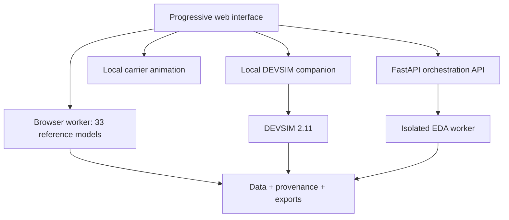

# OpenSemiLab

**An open, progressive semiconductor laboratory for classrooms, universities, and research.**

OpenSemiLab presents one coherent workflow on top of open scientific engines. Its Device Lab contains 33 device, circuit and fabrication modules and 63 guided experiments, from carrier intuition to measurement fitting and reproducible studies.

> Device Lab calculations and carrier animations run on the user's computer. The catalogue uses documented analytic/compact reference models; the silicon PN experiment also has an optional local DEVSIM companion.

The Design Studio executes **real RTL lint, simulation, synthesis, batch SPICE simulation, and asynchronous RTL-to-GDSII implementation** inside an isolated IIC-OSIC-TOOLS worker. Projects persist in the browser as multi-file workspaces and can be exported or imported. RF/EM and mixed-signal co-simulation remain staged integrations and are visibly marked as such.

## Why this project

Open-source EDA and multiphysics tools are powerful, but they expose different interfaces, data formats, and assumptions. OpenSemiLab does not replace those engines. It creates a common project model, progressive interface, orchestration API, and reproducible result format around them.

### Progressive depth

| Mode | Audience | What is visible |
|---|---|---|
| Explore | Secondary school | Physical controls, visual intuition, guided language |
| Learn | Introductory university | Concepts, units, bands, fields, carriers, I–V curves |
| Design | Engineering | Geometry, materials, contacts, doping, sweeps |
| Advanced | Graduate/professional | Mesh, models, equations, tolerances, convergence |
| Research | Researchers | Raw data, scripts, provenance, export, reproducibility |

## Current vertical slice

- Enter a dedicated **Design Studio** for complete IC and system projects.
- Create a tool-aware design plan for microcontrollers/SoCs, smart sensor interfaces, analog blocks, RF front-ends, standard cells/IP, and FPGA prototypes.
- Select SKY130, GF180MCU, IHP SG13G2, IHP SG13CMOS5L, or the research-only GT2N profile with an explicit integration/maturity notice and generate a reproducible staged manifest. SKY130/GF180 have the integrated digital path; IHP paths remain partial or scaffold-only, and GT2N is not exposed as an executable physical route.
- Register user-supplied private PDK packages in a local BYOPDK volume, inspect format/readiness coverage, translate readable commercial references into auditable KLayout/OpenRCX drafts, generate an isolated LibreLane/OpenPDKs adapter, and reference it from projects without redistributing licensed collateral. Exact metal-stack selection, M31 GDS/CDL export, calibration, and sign-off remain explicit gates. See [docs/private-pdks.md](docs/private-pdks.md).
- Map each stage to relevant IIC-OSIC-TOOLS engines while clearly distinguishing connected and pending adapters.
- Edit SystemVerilog in the browser and run Verible/Verilator lint, Icarus Verilog simulation, and Yosys synthesis in IIC-OSIC-TOOLS.
- Inspect automatically captured VCD waveforms with signal selection, zoom, and time-window navigation.
- Simulate VHDL-2008 projects with GHDL and capture their VCD output through the same portable result contract.
- Download the synthesized Yosys JSON netlist and inspect complete console output.
- Plot normalized ngspice `.print` results for DC, transient, AC, and noise analyses when those vectors are present in the testbench.
- Run LibreLane Classic asynchronously for SKY130/GF180 with automatic post-synthesis die sizing or expert manual dimensions, explore real DEF placement, density, 2D routing and an interactive exploded 3D layer view, review timing/area/DRC/LVS/electrical evidence plus an explicit production-readiness matrix, and export a categorized sign-off ZIP with SHA-256 checksums, an integration-view manifest and individual artifacts.
- Keep a bounded local execution history and compare implementation and simulation results.
- Navigate active projects through a compact five-stage vertical wizard, with an explicit IIC-OSIC integration matrix.
- Replay numeric simulation traces as animations, zoom them, and pan horizontally by dragging or using the window control.
- Explore silicon, transport, resistors, Hall effect, PN/PIN/Zener/Schottky/varactor/tunnel diodes, LED/photodiode/solar cells, BJT NPN/PNP, NMOS/PMOS/JFET, MOS capacitors, IGBT/SCR, CMOS/RC/RLC/rectifier circuits and SRH recombination.
- Experiment with diffusion, implantation/annealing, oxidation, photolithography, etching, deposition and yield; follow a twelve-stage conceptual fabrication walkthrough.
- Run analytic/compact models and bounded electron/hole/photon animations locally, keeping equations, units, physical limitations and numerical checks visible.
- Inspect bands, carrier/field/charge profiles, I–V/C–V/Gummel/transfer families, optical power, Bode responses, process profiles and yield.
- Run five-value parameter sweeps and seeded Monte Carlo studies with 10/20/40 samples, histograms, sample statistics and complete per-run export.
- Import measurements with optional absolute uncertainties, compare residuals without extrapolation, fit weighted lines and extract diode ideality/saturation current.
- Keep a notebook per guided experiment and export signed raw CSV, editable SVG figures and JSON bundles with an input fingerprint, references and actually executed parameters.
- Switch between five depth modes without changing the underlying experiment.
- Query engine capabilities and export a self-describing simulation result.
- Open local DEVSIM from the PN model in Advanced/Research mode; the browser detects a companion on the client computer and keeps the compute load off the shared server.
- Validate the DEVSIM result on 51/101/201-node meshes and download a JSON reproducibility bundle with engine version, input hash, convergence settings, and validation evidence.

## Architecture


```mermaid
flowchart TD
    UI["Progressive web interface"] --> API["FastAPI orchestration API"]
    UI --> BROWSER["Browser worker: 33 reference models"]
    UI --> CANVAS["Local carrier animation"]
    UI --> LOCAL["Local DEVSIM companion"]
    API --> EDA["Isolated EDA worker"]
    LOCAL --> DEV["DEVSIM 2.11"]
    BROWSER --> RESULT["Data + provenance + exports"]
    DEV --> RESULT
    EDA --> RESULT
```

The engine boundary is deliberate: copyleft tools can run as separate processes or services while OpenSemiLab keeps a stable, engine-neutral data contract. See [docs/LICENSING.md](docs/LICENSING.md).

### Device Lab

Open **Device Lab** from the persistent application navigation. The five depth
modes expose guided experiments, complete parameters, studies, measurements and
local TCAD controls. The notebook stays in this browser; export JSON to preserve
it outside the device. Analytic consistency checks are not hardware calibration
or foundry sign-off. See [docs/device-lab.md](docs/device-lab.md) for the complete
catalogue, units, experiment workflow, model scope, statistics and references.

### IIC-OSIC integration scope

IIC-OSIC-TOOLS is a broad distribution rather than one engine. OpenSemiLab reports each relevant tool as one of three levels instead of claiming that every installed executable is connected:

| Level | Current tools | Meaning |
|---|---|---|
| Direct | Verible/Verilator, Icarus/VVP, GHDL, Yosys, ngspice, LibreLane, SymbiYosys, nextpnr, Xyce, openEMS, Xschem, GDS3D, CACE | Invoked by a bounded worker workflow with portable results and artifacts. |
| Orchestrated | OpenROAD, OpenSTA, KLayout, Magic, Netgen | Invoked as part of the LibreLane physical flow. |
| Browser-native companion | GTKWave replacement, DEF/GDS physical explorer | Waveforms and physical layers are rendered interactively without exposing a remote desktop. |

GUI editors, Python libraries, PDK managers and highly specialized utilities remain available in the underlying image but are not mislabeled as web integrations.

GT2N is intentionally registered only as a research project profile. Its collateral and the engineering gates required before an executable adapter are documented in [docs/gt2n-integration.md](docs/gt2n-integration.md).

The specialized adapter cards infer their entry point from project files and remain disabled until a compatible input exists:

| Workflow | Accepted project input | Portable result |
|---|---|---|
| SymbiYosys | RTL plus optional `.sby` | selectable bounded BMC or inductive proof, with PASS/FAIL/INCONCLUSIVE status and traces |
| nextpnr iCE40 | RTL plus optional `.pcf` | synthesized JSON and routed `.asc` |
| Xyce | `.cir` / `.spice` | logs, raw tables, normalized animated plots |
| openEMS | solver `.xml` | field, CSV, VTK and Touchstone files |
| Xschem | `.sch` with project symbols/models | headless SPICE netlist |
| CACE | a file named `cace*.yaml` or `datasheet*.yaml/json` | characterization reports, tables and plots |
| GDS3D | GDSII from the latest LibreLane run | bounded native import validation; interactive layers remain in the browser |

FPGA projects may define `execution.fpga_top` independently from `execution.rtl_top`. This lets a reusable core keep its full internal bus interface while nextpnr implements a small board wrapper with only real package pins. The worker checks top-level I/O against known iCE40 package capacity before place-and-route and reports an actionable wrapper diagnostic.

### Source editor and execution console

Project files use a local CodeMirror editor with syntax highlighting for HDL,
SPICE, Python, JSON, YAML, Markdown (including fenced code), Tcl, Makefiles and
other supported source files. Line numbers, matching brackets, folding, search,
undo/redo and indentation are available. Makefiles indent with tabs, Python with
four spaces and other sources with two spaces. Escape followed by Tab leaves
the editor; the line-wrap button keeps long lines readable.

The result console and live physical-flow dock distinguish timestamps, tool
tags, warnings, errors, successful checks, commands, paths and numeric values.
Severity words remain visible alongside their colors. ANSI terminal control
sequences are removed from the display; output is rendered as text. Long logs
use a viewport, while Select all and Copy all operate on the complete output.
The editor runs in the browser and is bundled with the portal, without a CDN.

Validation: `cd apps/web && npm test` checks real language tokenization;
`npm run test:browser` checks editing, undo, search, safe read-only logs and
complete copying of large logs using Chromium.

### Documented, executable starter templates (v2)

New projects include commented sources, self-checking testbenches, numerical
acceptance criteria, a Makefile, modification guides and implementation limits.
Use **Sources .zip** in the project toolbar to download an actual multi-file
workspace; from the extracted root run `make check` and `make test`.
The normal JSON export still preserves a reimportable project snapshot.

| Starter | Runnable reference | Further implementation work |
|---|---|---|
| Microcontroller / peripherals | Register bus, GPIO, timer, watchdog, regression, formal harness and FPGA wrapper | Integrate a CPU/memory/bus bridge; no RISC-V core is included |
| Sensor | Signed average, calibration, saturation, ready/valid backpressure and independent analog RC/gain simulation | Real ADC, CDC, noise and mixed-signal integration |
| Analog | Amplifier macromodel, AC/transient metrics and parameter sweep | Transistor topology, actual PVT/mismatch and custom layout |
| RF | LC network, SPICE sweep, analytical S-parameters, CSV/Touchstone export and passivity checks | Active RF devices, materials, ports, meshing and EM extraction |
| Standard cell | Logic/formal truth table, generic CMOS VTC and delay measurements | Foundry models, complete characterization, Liberty and legal LEF/GDS |
| FPGA | PWM/heartbeat, synchronizer, debounce and quantified duty tests | Actual board pinout, voltage, clock and programming |
| Blank | Validated structure, verification plan and workflow recipes | Add a design; it deliberately contains no example circuit |

Microcontroller and FPGA also provide a separate, self-checking VHDL-2008
GPIO/counter/PWM variant. GHDL runs it; the current web implementation adapters
still require Verilog/SystemVerilog for synthesis/physical/FPGA workflows.

Templates are stored as readable assets in `apps/web/src/templates/`. Version 2
is recorded in `project.json`; existing projects retain their previous sources
and are **not** overwritten or merged with an incompatible new starter.
Create a new project to get v2. Deleted v2 files remain deleted on reload.
Generic models and analytical responses are not foundry sign-off evidence.
DEVSIM continues to run on the **client computer**, not on the portal server.

Validation: `cd apps/web && npm test`; worker tests generate the same browser
assets and exercise real Icarus, Yosys, ngspice and GHDL when installed. CI
requires those tools, so missing binaries cannot silently skip execution checks.

### Project import

The Design Studio accepts both exported `.opensemilab.json` files and public repository-root URLs such as `https://github.com/owner/project`. GitHub imports are downloaded through fixed GitHub API/codeload hosts, bounded by archive, file-count and text-size limits, and converted into the portable OpenSemiLab project schema. The importer detects supported design files, assigns roles, infers a likely RTL top, records provenance, and leaves `project.json` editable for project-specific refinement.

## Quick start

### Docker Compose

```bash
docker compose up --build
```

The first build downloads the IIC-OSIC-TOOLS image, which is substantially larger than the web/API images and can take considerable time. Later starts reuse Docker's local cache.

Open <http://localhost:5173>. The API documentation is at <http://localhost:8000/docs>.

### First administrator and SMTP

No fixed production administrator password is shipped. Register the intended account in the web UI, then list and promote it from the API container:

```bash
docker compose -p opensemilab exec api opensemilab-admin list
docker compose -p opensemilab exec api opensemilab-admin promote your-address@university.edu
```

After signing in again, **Admin > Outgoing mail server** configures SMTP and sends a live test message. SMTP passwords are encrypted before storage and are never returned by the API. Production deployments should define stable `OPENSEMILAB_SETTINGS_KEY`, `OPENSEMILAB_PUBLIC_URL`, and secure cookies in `.env`:

```dotenv
OPENSEMILAB_SETTINGS_KEY=a-separate-random-secret-at-least-32-characters
OPENSEMILAB_PUBLIC_URL=https://opensemilab.example.edu
OPENSEMILAB_COOKIE_SECURE=1
```

### Local development

Requirements: Node.js 20+, Python 3.11+.

```bash
# terminal 1
cd services/api
python -m venv .venv
. .venv/bin/activate
pip install -e '.[dev]'
uvicorn opensemilab_api.main:app --reload

# terminal 2
cd apps/web
npm install
npm run dev
```

### Local DEVSIM companion

DEVSIM is intentionally installed and executed on the user's computer. The companion binds only to `127.0.0.1:8787`; the web app sends DEVSIM experiments directly to it. Device Lab reference calculations run in a browser worker; the existing educational PN API remains available for clients using that contract.

The validation assumptions, canonical reference mapping, quantitative thresholds, and limitations are documented in [docs/devsim-validation.md](docs/devsim-validation.md).

Linux/macOS:

```bash
./scripts/install-devsim-local.sh
```

Windows PowerShell:

```powershell
.\scripts\install-devsim-local.ps1
```

Then open Device Lab, select the PN junction, choose Advanced or Research and open **Local DEVSIM and mesh validation**. A deployed portal origin can be authorized with `OPENSEMILAB_ALLOWED_ORIGINS=https://your-portal.example` before starting the companion. Linux requires BLAS/LAPACK runtime libraries; the install script automatically selects the common versioned library names when present.

### Tests

```bash
cd services/eda-worker && python -m unittest discover -s tests -v
cd services/api && pytest
cd services/devsim-worker && DEVSIM_MATH_LIBS=liblapack.so.3:libblas.so.3 pytest
cd apps/web && npm test && npm run test:browser
cd apps/web && npm run build
```

## Repository map

```text
apps/web/             Progressive React interface
services/api/         FastAPI orchestration and simulation adapters
services/eda-worker/  Constrained IIC-OSIC-TOOLS execution bridge
services/devsim-worker/ Local Poisson/drift-diffusion companion
docs/                 Architecture, pedagogy, licensing, roadmap
examples/             Versioned experiment examples
.github/workflows/    CI for API tests and web builds
```

## Scientific scope and honesty

The built-in solver is intentionally labeled **educational**. It produces transparent, deterministic approximations useful for teaching and UI development; it is not a TCAD sign-off engine. Professional claims must come from a validated external engine, recorded mesh/model settings, convergence evidence, and comparison against reference measurements or benchmarks.

## Roadmap

1. Add live per-stage LibreLane progress and exact polygon rendering from GDSII.
2. Extend nextpnr from iCE40 ASC output to board-specific bitstream packing/programming profiles.
3. Normalize Xyce/CACE/openEMS numeric outputs into the animated chart schema and add curated Xschem round-trip templates.
4. Extend DEVSIM validation from the PN baseline to calibrated reference measurements.
5. Add optional server-side project storage and Git synchronization while retaining local JSON portability.
6. Extend the browser reference catalogue with calibrated device models and additional local TCAD geometries.
7. Integrate Gmsh, VTK, and electro-thermal adapters.

## Contributing

See [CONTRIBUTING.md](CONTRIBUTING.md). Scientific contributions should include units, assumptions, references, validation evidence, and a reproducible example.

## License

OpenSemiLab's original code is licensed under the [Apache License 2.0](LICENSE). External engines and PDKs retain their own licenses and are not redistributed by this repository unless explicitly stated.
